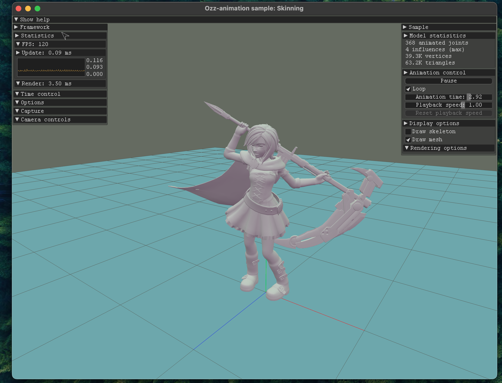
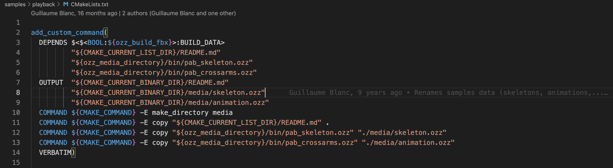

The [ozz-animation](https://guillaumeblanc.github.io/ozz-animation/) library has a handful of samples that show how to use different features of the library. If you click on a specific sample on the website you can view an Emscripten render of each sample code example. For our purposes it will be useful to modify, experiment with, and spend time getting familiar with the source-code of the samples. 

Follow the first two sections on [this page](https://guillaumeblanc.github.io/ozz-animation/documentation/build/) to clone a local copy of the repo and build the project. After those steps I was able to run the samples on my machine by going to one of the samples in the `build/samples` folder and running the executable. Below is a screenshot after running `build/samples/skinning/sample_skinning` from the root directory.

The application source-code for each sample is found in `samples/`. In each folder you will find a `CMakeLists.txt` file that contains the options for building the samples. The dependencies for building the project are listed at the top. Here is what it looks like for the `playback` sample.

`pab_skeleton.ozz` and `pab_crossarms.ozz` are archive skeleton and animation files respectively used in this sample. You can replace `pab_crossarms.ozz` with `pab_run.ozz` in the `DEPENDS` and `copy` commands and rebuild the project. Now, if you run `build/samples/playback/sample_playback` you will see the run animation being applied to the skeleton instead of the original arms crossing one.

The `.cc` files contain the application code. Here you will typically find the loading of the skeleton and animation from their archive files, as well the update and display functions, amongst others.
